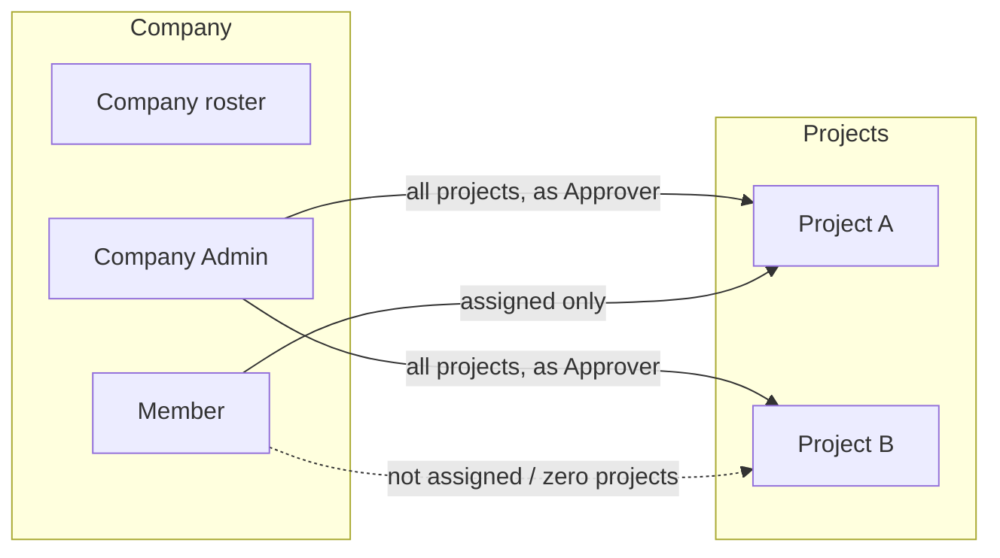

# Members experience — UX design spec

Date: 2026-08-31
Status: approved for implementation (UX). Engineering plan is a separate follow-up pass (see Appendix).

## Outcome

Replace the single company-wide `isApprover` boolean and implicit "everyone sees every project" model with a two-layer role system — Company (**Member** / **Company Admin**) and Project (**Reviewer** / **Approver**) — plus a real member directory, invite flow, and detail page. A client-side **Company Admin** gets the same member-management powers as agency staff, scoped to their own company.

This spec was produced by three UX workstreams (IA, content, visual), each reviewed and revised at least once against the quality gate below before being accepted here. Nothing in this document is a first draft.

## Decision log (product rules — not open for reinterpretation by implementers)

1. **Administration parity.** Staff and client-side Company Admins have the *same* powers over company members: invite, assign/remove project access, change project roles, remove from company, promote/demote admins. They use different apps. Staff accounts are not part of the company roster.
2. **Invite requires a project.** Inviting a Member requires assigning at least one project at invite time. Company Admin invites skip project selection — access is automatic.
3. **Roster independence.** Company membership is independent of current project access. A Member can end up with zero projects and remains a normal, visible roster entry — never an error state.
4. **Two named role layers, no permission matrix.** Company: Member or Company Admin. Project: Reviewer (comment only) or Approver (Approve / Request changes / Reject). No per-feature toggles, no custom roles.
5. **Company Admin = automatic Approver on every project, including future ones.** This is the single highest-stakes grant in the product; every surface touching it must make "current *and future*" unmissable.
6. **Demotion keeps access, drops rights.** A demoted Company Admin keeps every project they had, but drops to Reviewer on all of them and loses admin tools.
7. **Last Company Admin is protected, asymmetrically.** A company can have multiple Company Admins. The client app blocks a Company Admin from demoting/removing the *last* remaining Company Admin. Staff can, behind a checkbox-gated confirmation.
8. **Removal preserves history.** Removing a member from the company revokes all access immediately, but their past comments and decisions stay visible, attributed to them, suffixed `(removed)`. No hard delete of authored content, no soft-delete/archive view of the roster itself (nothing else in this app has one).

## Model, at a glance

Company Admin is not "one more project role" — it is company-wide authority *plus* automatic, dynamic participation. Member access is assignment-based and may be empty.

## 1. Information architecture

### Where Members lives

- **Staff app:** the company workspace (`/staff/companies/:companyId`) keeps its Projects section and gains a matching Members section — a short alphabetical preview with a row count and an "Open directory" link. The full directory is its own page, `/staff/companies/:companyId/members`; rows open a full detail page, `/staff/companies/:companyId/members/:memberId`.
- **Client app:** a "Members" nav entry appears only for signed-in Company Admins (`/client/members`, scoped to their own company; guarded server-side, not just hidden in the nav). Regular Members get no entry and no route access. Detail: `/client/members/:memberId`.
- Both apps share the same directory/detail shape and interaction model — this is deliberate, not incidental: administration parity (decision 1) means the UX must look like one system operated from two apps, not two products.

### Directory

- Row: identity (name + email, stacked, existing pattern) on the left; a single **access-summary** tag on the right that always states *role*, not just *presence* — see Content, Section 1.
- Toolbar above the list: search (name/email), a Role filter (All / Company Admin / Member), a Project filter (All projects / a specific project / No project access — this filter is the sanctioned way to see "who's on Project X"; there is no separate project-scoped people page), and a sort control (Name / Role / Date added). Always present regardless of company size — three people or eighty, the controls don't change, only their necessity does.
- Two distinct empty states, deliberately different in weight (see Visual, Section 3): a fresh company with only the inviter ("You're the only one here" + an emphasized Invite action) versus a populated roster that a filter matches nothing ("No matches" + Clear filters, no invite prompt).
- No pagination, no virtualization, no dense mode — the row never changes shape with scale; only search/filter/sort carry the weight of a larger roster.

### Invite

Single inline expanding panel (not a modal, not a wizard) above the list, matching the app's existing inline-creation pattern:

1. Name, Email.
2. Company role toggle: Member (default) / Company Admin.
3. Conditional block:
   - **Member**, company has 2+ projects: a checklist of every project, each with a Reviewer/Approver picker that activates once checked. At least one required.
   - **Member**, company has exactly 1 project: no checklist — a single line auto-assigns that project with a role picker. A one-item checklist would read as broken, not intentional.
   - **Member**, company has 0 projects: the Member option is disabled with inline copy explaining why (see Content 2).
   - **Company Admin**: no project picker at all — a static line states the automatic current-and-future grant.
4. Submit label reflects the choice (`Invite member` / `Invite as Company Admin`). Choosing Company Admin adds one confirmation step before creation; choosing Member does not (beyond the required-project validation).

### Member detail

Full page, not a drawer or modal — consistent with every other entity in this app (click a row, land on a page with a back link). A drawer has no precedent here and would either compress the directory or force a second overlay pattern on top of the confirm dialogs this page already needs.

Sections, top to bottom, in ascending order of stakes (mirrors a conventional "settings page → danger zone at the bottom" structure):

1. **Identity** — inline-editable name/email.
2. **Company role** — role tag + a single promote/demote action, positioned directly under the page title (visible on load, not scrolled to). Promoting flips the Project access section into its locked, automatic state immediately; demoting flips it back to editable and drops every row to Reviewer, with a one-time confirmation banner stating the count.
3. **Project access** — every company project listed (not only assigned ones, so add/remove reads as a toggle). Assigned rows show a Reviewer/Approver picker + Remove; unassigned rows show Not assigned + Add. Fully locked/read-only when viewing a Company Admin.
4. **Remove from company** — isolated, final section. Removes all access; historical comments/decisions remain, attributed and suffixed `(removed)`.

### Edge, empty, and blocked states (explicit UI states, not afterthoughts)

- **Zero-project member:** neutral `No project access` tag, no warning styling.
- **Fresh company (roster = inviter only):** emphasized, low-key CTA empty state.
- **Filtered-to-zero:** neutral, no CTA, just Clear filters.
- **Zero-project company:** Member invite disabled with an explanation; Company Admin invite still works, copy adapts to "no projects yet."
- **Last Company Admin, client app:** demote/remove render `aria-disabled` (present and perceivable, not hidden) with adjacent causal text.
- **Last Company Admin, staff app:** same actions stay enabled behind a checkbox-gated confirm — the strongest confirmation tier in this spec.
- **Removing a member's last project:** a lightweight inline confirm strip (not a full dialog) stating they'll have zero access but remain on the roster.

### Safety tiering

| Action | Confirmation |
|---|---|
| Add/assign a project, change a Reviewer/Approver role | None — additive or lateral, always reversible |
| Remove one of several projects | None — other access remains |
| Remove a member's last project | Inline confirm strip |
| Promote to Company Admin, demote to Member, remove from company (non-last-admin) | Modal confirm |
| Demote/remove the *last* Company Admin (staff only) | Checkbox-gated modal confirm |
| Invite as Company Admin | Modal confirm at submit |

Rule: anything that only adds access is instant; anything that removes standing access or membership is confirmed proportional to how hard the mistake would be to notice and undo.

### Accessibility

- Confirm dialogs are native `<dialog>` (`showModal()`) — real focus trap, Escape-to-cancel. Focus opens on Cancel (safe default against an accidental Enter), and returns to the triggering control on any exit.
- The last-admin block in the client app uses `aria-disabled` (not the native `disabled` attribute) so the control stays in the tab order and reachable by screen readers, linked via `aria-describedby` to its explanation.
- The truncated access-summary tag carries a full, role-inclusive `aria-label` (see Content 5) — the complete list is never hover-only.
- The lightweight "remove last project" strip uses the same non-trapping, inline-disclosure pattern as `AccountCluster`'s existing `
` popover — proportional to its lower stakes, not a second modal system.

### Explicit non-goals

No permission-matrix UI, no bulk actions/CSV import, no project-first "people" tab (the directory's project filter covers that need).

## 2. Content

Full copy deck — every string below is final, not placeholder.

### Directory

- Heading: `Members`
- Access-summary grammar (role always included — this is what makes the tag answer "what can they do," not just "what are they in"):
  | Case | Template | Example |
  |---|---|---|
  | Company Admin | `Company Admin · all projects` | `Company Admin · all projects` |
  | 0 projects | `No project access` | `No project access` |
  | 1 project | `{Role} on {ProjectName}` | `Approver on Riverside Rebrand` |
  | 2 projects | `{Role1} on {ProjectName1} · {Role2} on {ProjectName2}` | `Approver on Riverside Rebrand · Reviewer on Q3 Launch` |
  | 3+ projects | `{Role1} on {ProjectName1} · +{N} more` | `Approver on Riverside Rebrand · +2 more` |
- Filters: Role (`All roles` / `Company Admin` / `Member`), Project (`All projects` / per-project / `No project access`). Search placeholder: `Search name or email`. Sort: `Name` · `Role` · `Date added`.
- Empty (fresh company): **`No members yet`** / `You're the only one here. Invite your team to get them into projects.` / button `Invite member`.
- Empty (filtered): **`No matches`** / `No members match your search and filters.` / button `Clear filters`.
- Zero-project banner: `This company has no projects yet. New members can only be invited as Company Admin until one exists.`

### Invite panel

- Fields: `Name` (`Full name`), `Email` (`name@company.com`), role toggle `Member` / `Company Admin`.
- No project checked: `Select at least one project.`
- Member disabled (0 projects): `Requires at least one project.` + helper `This company has no projects yet — you can only invite as Company Admin.`
- Single project: `Only one project exists — {ProjectName} will be assigned automatically.`
- Company Admin static notice: `Gets Approver access to all current and future projects — automatically, without being added to each one individually.`
- Submit: `Invite member` / `Invite as Company Admin`.
- Admin invite confirm: **`Invite as Company Admin?`** / same notice line as above / Confirm `Invite`, Cancel `Cancel`.

### Member detail

- Sections: `Identity` · `Company role` · `Project access` · `Remove from company`.
- Role tags: `Company Admin` / `Member`; `Reviewer` / `Approver`.
- Buttons: `Promote to Company Admin` / `Demote to Member`.
- Locked-state notice: `Approver on all current and future projects — automatic, not editable. Demote to Member to manage project access individually.`
- Post-demote banner: `Downgraded to Member. No projects to update.` (0) / `Downgraded to Reviewer on 1 project.` (1) / `Downgraded to Reviewer on {N} projects.` (N≥2)
- Project rows: `Not assigned` + `Add`; assigned row shows role tag + `Remove`.
- Removed-member attribution: `{Name} (removed)`.

### Confirm dialogs

- Promote: **`Promote to Company Admin?`** / `{Name} gets Approver access to all current and future projects — automatically, without being added to each one individually.` / `Promote` · `Cancel`.
- Demote: **`Demote to Member?`** / `{Name} keeps Reviewer access on every project they're on now, but loses Approver access and won't be added to future projects automatically.` / `Demote` · `Cancel`.
- Remove: **`Remove {Name} from the company?`** / `{Name} loses access to every project immediately. Their past comments and decisions stay visible, attributed to them and marked (removed).` / `Remove` · `Cancel`.
- Last-admin demote (staff): **`Demote the last Company Admin?`** / `{Name} is the only Company Admin. Demoting them leaves no one with automatic Approver access to every project — future projects will need admins assigned manually.` / checkbox `Yes — demote the only Company Admin. No one will have automatic access to every project.` / `Demote` (disabled until checked) · `Cancel`.
- Last-admin remove (staff): **`Remove the last Company Admin?`** / `{Name} is the only Company Admin. Removing them leaves no one with automatic Approver access to every project, and {Name} loses access to everything immediately.` / checkbox `Yes — remove the only Company Admin. No one will have automatic access to every project.` / `Remove` (disabled until checked) · `Cancel`.
- Remove-last-project strip: `Removing {ProjectName} leaves {Name} with no project access. They stay on the roster as a Member.` / `Remove` · `Cancel`.

### Blocked state / accessibility copy

- Client-app last-admin block: `Only Company Admin — can't be demoted or removed. Promote another Member first.`
- Truncated-tag `aria-label`: `Access to {Total} projects: {Role1} on {ProjectName1}, {Role2} on {ProjectName2}, …, {RoleTotal} on {ProjectNameTotal}` — role-inclusive, matching the visible tag.

## 3. Visual treatment

Strictly within the existing monochrome system (`Ink #111111`, `Muted #6b6b6b`, `Quiet #8a8a8a`, `Rule #e8e8e8`, `Fill #f6f6f6`, `White`; `wf-list`/`wf-row`/`wf-tag`/`wf-panel`/`wf-btn`/`wf-btn-solid`/`wf-input`/`wf-select`/`wf-segment`/`wf-dash`/`wf-link-muted`/`wf-avatar`; `PageShell`/`PageHeader`/`ListHead`). No new colors, no new motion.

- **Directory row:** standard `wf-row` (identity left, stacked name/email; access-summary tag right, `wf-tag` geometry, no border/pill). Company Admin tag renders in `Ink` (full contrast — a company-wide, high-stakes fact); a project-role summary renders in `Muted` (supplementary detail, same tier as other secondary copy). `+N more` renders in `Quiet` — the lowest information tier, same role as timestamps. **Company Admin does not reuse the "Approved" ink-fill tag treatment** — ink-fill is reserved for one specific meaning (a terminal decision state on a deliverable); reusing it for a role would blur that single reserved signal.
- **Toolbar (search/filter/sort):** `wf-input`-sized search plus two restyled native `<select>`s, grouped and separated from `ListHead` by spacing and by shape (pill controls vs. the flat, rule-bound list header) — never a second header row.
- **Empty states:** the milestone state (fresh company) gets list-title-scale `Ink` heading, a `wf-btn-solid` CTA, and generous padding (`py-12`–`py-14`); the filtered-empty state stays at the existing plain pattern (`text-sm`, `Muted`, `py-8`, no button). The difference is entirely weight/color/padding/CTA-presence, never decoration.
- **Invite panel:** `wf-panel` on `White` (not `Fill` — that token is reserved for hover/canvas-well states), expands inline between the toolbar and `ListHead`, pushes the list down rather than overlaying it. The conditional project-picker region mounts/unmounts as a fixed block within the panel's spacing rhythm — no animation (system rule: no motion beyond hover/focus), just a predictable, whole-row height change. Single-project case collapses to plain `Muted` meta-scale text, no one-item checklist.
- **Detail page:** sections separated by hairline `Rule` dividers (not spacing alone — this app's existing grammar for sequential-but-distinct content, and more robust than spacing when section lengths vary wildly). Role tag + promote/demote button sit directly under the page title, in the existing `flex items-center justify-between` header pattern. The locked/automatic project-access state is signaled structurally (a `.wf-dash` divider instead of solid `Rule`, and static full-contrast text reading as a fact) — never by opacity/dimming, which would misread as "broken" rather than "automatic."
- **Confirm dialogs (first modal in this product):** `wf-panel` styling scaled down (~420–480px, centered, no heavy ink frame — this system's restraint applies to modals too). Commit action (`wf-btn-solid`) on the left, `Cancel` (`wf-btn` ghost) on the right, matching the existing decision-strip button order in the deliverable viewer. **New, minimal addition:** overlay scrim at `Ink` 40% opacity (`rgba(17,17,17,0.4)`) — no modal existed before this, so no scrim value did either; 40% keeps it inside this system's restrained register rather than a conventional heavier black scrim. Checkbox-gate variant: full-contrast `Ink` label (a gate reads at decision weight, not meta weight), separated from the body copy, controlling the confirm button's existing enabled/disabled state — no new "locked" visual invented.
- **Disabled last-admin button:** reuses the existing disabled treatment exactly (0.35 opacity, no invert) — a second disabled style would force two learned meanings for "dimmed." Differentiation lives entirely in the adjacent `Muted`, meta-scale, causally-phrased explanatory text (`Can't remove — last admin`), placed immediately next to the control.

## Quality gate — final sign-off

1. **Company membership vs. project access unmistakable?** Yes — roster independence (decision 3) is a first-class, non-error state throughout; the directory, invite flow, and detail page all treat "in the company" and "on a project" as separate facts.
2. **At-a-glance legibility of access and decision power?** Yes, after the content revision — every access-summary tag states role, not just presence.
3. **Company Admin's all-project grant unavoidable to notice?** Yes — stated in the invite static notice, the promote confirm, the directory tag ("· all projects"), and the locked detail-page notice; every instance uses "current and future."
4. **Zero-project, last-admin, demote-to-Reviewer, staff-only-override paths designed?** Yes — each has an explicit UI state and, where relevant, its own confirmation tier.
5. **One-project company stays simple?** Yes — the invite flow collapses to a single auto-assigned line, no empty checklist.
6. **Roles, not a permission matrix?** Yes — reaffirmed as an explicit non-goal.
7. **Staff and client admin operate one model?** Yes — same directory/detail shape, same copy, same confirms; the only asymmetry (last-admin override) is a deliberate, named exception, not an accidental divergence.
8. **Accessibility — keyboard, focus, labels, confirmations?** Yes — native `<dialog>` focus trapping with defined focus return, `aria-disabled` (not `disabled`) for the perceivable-but-blocked last-admin case, role-inclusive `aria-label` for truncated tags.

Approved. Two revision cycles were required to reach this state: the IA spec was returned once for a missing removed-member/comments-attribution rule and thin accessibility detail; the content deck was returned once for silently dropping per-project roles from the access-summary grammar, which would have broken quality-gate item 2 had it shipped unnoticed.

---

## Appendix: engineering handoff notes (not implemented in this pass)

Per the plan, engineering follows UX approval as a separate planning pass. These notes exist so that pass doesn't have to re-derive the shape from this spec.

- **New model**, e.g. `ProjectMembership { userId, projectId, role: REVIEWER | APPROVER }`, unique on `(userId, projectId)`. Explicit rows only for Members — Company Admin access to all projects should be *computed*, not materialized as rows (otherwise every new project requires backfilling a row per admin).
- **`User`** gains a company-level role (`MEMBER | COMPANY_ADMIN`) replacing `isApprover`. `isApprover` should be retired from the UI immediately but the column can be dropped in a later migration once `ProjectMembership` is backfilled from it (Northwind/Alpine seed data currently uses `isApprover: true/false` per client — map `true` → Approver on their existing single project, per the current seed's one-project-per-approver shape).
- **Demotion must materialize rows.** Because Company Admin access is computed (not stored), demoting one requires writing real `ProjectMembership(role: REVIEWER)` rows for every current project at the moment of demotion — this is the one point where "automatic" access has to become "explicit" data, per decision 6.
- **Removal must not hard-delete the `User` row** — `Comment.author` and `Version.decidedBy` reference it, and decision 8 requires historical attribution to survive. Needs a `removedAt` (or `status`) field on `User`; directory queries exclude removed users, comment/decision rendering checks the field to append `(removed)`.
- **Guard logic:** last-Company-Admin count per company gates `demoteToMember`/`removeFromCompany` — reject client-app calls, allow staff-app calls (needs a distinct action or a `confirmed: true` param plus a role check on the caller).
- **New actions needed:** `inviteMember` (rewritten to require ≥1 project for Members, none for Admins), `promoteToCompanyAdmin`, `demoteToMember`, `addProjectAccess`, `removeProjectAccess`, `changeProjectRole`, `removeMemberFromCompany`.
- **New routes:** `/staff/companies/:companyId/members`, `/staff/companies/:companyId/members/:memberId`, `/client/members`, `/client/members/:memberId` (guarded to Company Admins).
